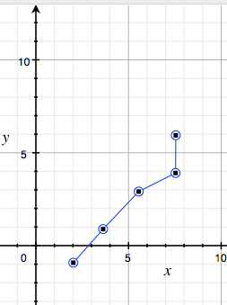
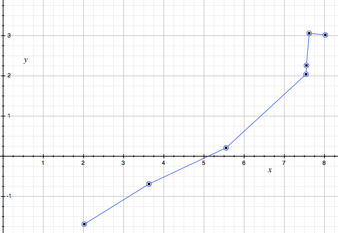
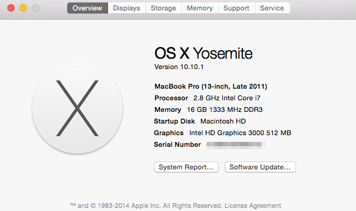

# AccelerateExample

Sample usage of the Accelerate framework

## Usage

Uncomment the various method calls to compare CPU time necessary to compute matrix multiplication in a naive implementation vs an accelerated implementation.

## Results

### Naive

### Accelerated

## Notes

Results for matrix multiplication obtained from running on a Late 2011 MacBook Pro 13” i7 with 16GB memory

